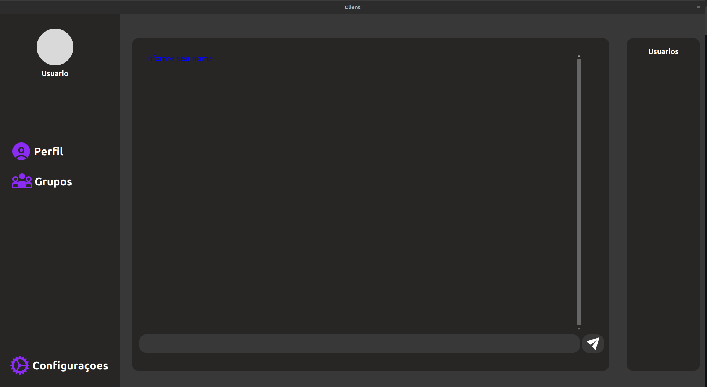

---
## 💻 Client Server Chat

Um projeto simples de chat utilizando sockets e JavaFX, permitindo comunicação entre cliente e servidor.

### 📃 Dependencias

Para conseguir executar o projeto é necessario que você tenha o JavaFx

### ⚙️ Como Executar

Para executar o projeto, siga os passos abaixo você precisa executar primeiro o
Server e depois o UI

### Contribuições

Contribuições são bem-vindas! Sinta-se à vontade para enviar pull requests ou relatar problemas.

### Licença

Este projeto está licenciado sob a [Licença MIT](LICENSE).

---
